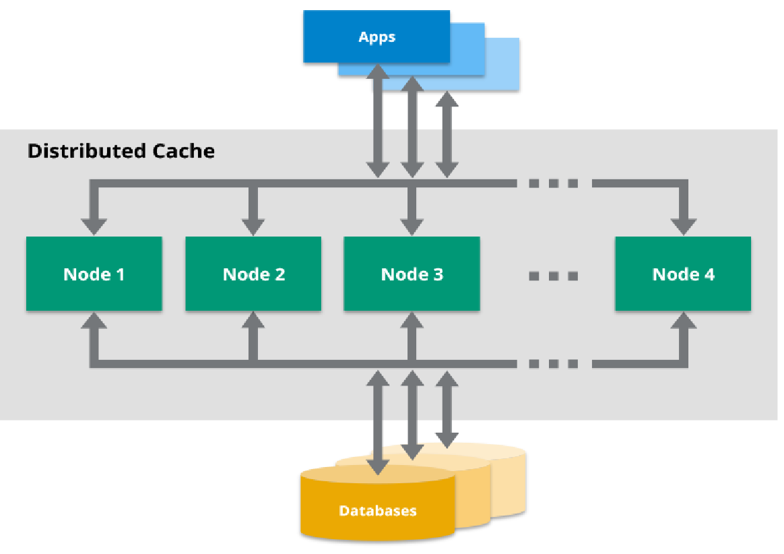

= Hazelcast

Before Understanding the Hazelcast lets understand some of the below topics.

*What is Cache?*

In Computing industry , a cache is a hardware or software component that stores the data for server so that future data request can be  faster.

*Why Cache is needed ?*

We know that cache used by CPU/hardware that helps to process faster. What if this concept can be taken to the application/software level. This is where Caching helps.

There are many types of the Cache like local cache ie means only to the localof your application for eg HashMap just hold that data for that class or method its local to the class .what if you want to access all over other nodes. then comes distributed cache.

*What Is a Distributed Cache ?*

A distributed cache is a system that pools together the random-access memory (RAM) of multiple networked computers into a single in-memory data store used as a data cache to provide fast access to data

*What are the Distributed Cache Softwares?*

There are many tools or software for Distributed Cache , in that Redis and Hazelcast is most widely used Distributed.

*Why Hazelcast ?*

Hazelcast provides the leading in-memory computing platform for high-performance data processing at scale, accelerating applications for the most innovative global brands

https://hazelcast.com/why-hazelcast/[]

Compare Redis and Hazelcast

|===
|Redis |Hazelcast

|Caching: Redis Uses only on pattern for caching(cache-aside pattern)
|Caching: Hazelcast Uses number of patterns (read-through, write-through, and write-behind)

|Clustering: Redis requires manual intervention
|Clustering: Most clustering operations are handled automatically by Hazelcast

|Querying: Redis does not understands complex object graphs and provides querying API.
|Querying:Hazelcast understands complex object graphs and provides querying API.

|Streaming: Redis supports  pub-sub messaging to distribute streaming data
|Streaming: Hazelcast comes with a full streaming stack(Messaging ,processing ,connectors)

|Compute : Redis supports Lua Scripts
|Compute : Hazelcast allows Java and soon Python & C++

|===

More reference can found here.
https://hazelcast.org/compare-with-redis/#:~:text=The%20biggest%20difference%20between%20Hazelcast,this%20introduces%20extra%20network%20hops[]

*What is Hazelcast ?*

In computing, Hazelcast IMDG is an open source in-memory data grid based on Java. It is also the name of the company developing the product, Hazelcast provides central, predictable scaling of applications through in-memory access to frequently used data and across an elastically scalable data grid.

*Use Case for Hazelcast?*

Typical use-cases for Hazelcast include:

* Application scaling
* Cache-as-a-service
* Cross-JVM communication and shared storage
* Distributed cache, often in front of a database
* In-memory processing and Analytics
* In-memory computing
* Internet of Things infrastructure
* Key-value database
* Memcached alternative with a protocol compatible interface[5]
* Microservices infrastructure
* NoSQL data store
* Spring Cache
* Web Session clustering

